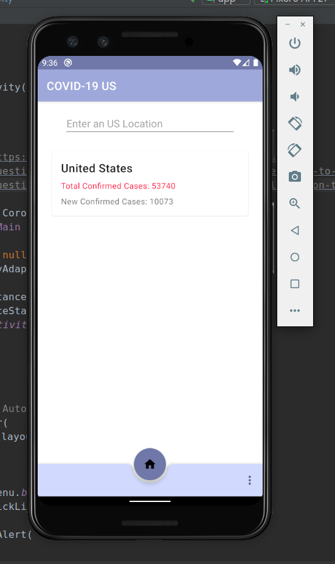

# Covid-19 US

## Screenshot

## Description
Android app that allows users to query the __[Covid19 Api](https://covid19api.com/)__ for data on cases throughout the US.

## Technologies Used
__[Coroutines](https://kotlinlang.org/docs/reference/coroutines-overview.html)__
__[Retrofit](https://square.github.io/retrofit/)__